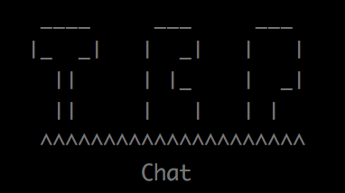

# TCPchat

**Author**: Joshua Fredrickson

**Version**: 1.0.0 

## Overview
TCPchat is a TCP chatting application.

## Getting Started
To use the Lab 13 application, [Node.js](https://nodejs.org/en/), [npm](https://www.npmjs.com/) 
(Node Package manager), and for non-Mac users, [NetCat](https://www.digitalocean
.com/community/tutorials/how-to-use-netcat-to-establish-and-test-tcp-and-udp-connections-on-a-vps)  will need
 to be locally installed.  Once Node.js and npm have been installed, install the TCPchat files.  
 Prior to starting the TCPchat application, from the command line while you are in the TCPchat file 
 folder, enter the command `npm i`.  This will download all needed dependencies for the 
 application to run.  To start your TCP Server, you will need to type `node server.js` from the 
 TCPchat directory in your command line. 

## Architecture
TCPchat the following modules to operate.
 - server.js: this runs the server and operates the chatroom.
 - client.js: this is where the users class is.
 - command.js: this is where the command logic is stored.
 - logger.js: this is were the logs functionality is stored.
 - log.log:  this is were the information and error logs are stored.
 
This application was deployed with the following technologies.
Node.js, npm, body-parser, dotenv, express, faker, mongoose, winston, babel, superagent, 
http-errors, jest, eslint, net, uuid, NetCat, and  JavaScript
 

## Change Log 
05-05-2018  12:11am  Refactoring project
05-05-2018  1:06am   Chat is working with bugs
05-05-2018  1:27am   Bugs are gone
05-05-2018  1:30pm   Working on README

## Credits and Collaborations
Thanks to all of the Code Fellows staff and fellow 401-d23 students.

#### A Very Special Thanks to Joy Hou for teaching me about TCP servers in a way that I could understand!
